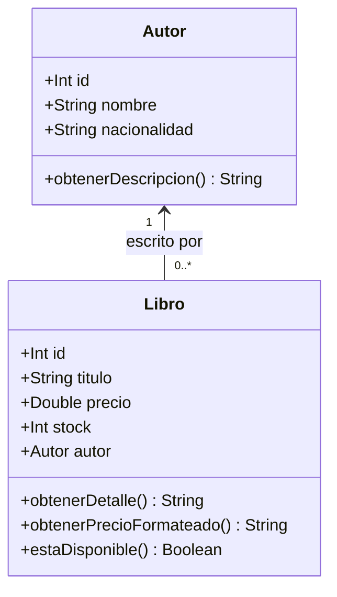

# Checkpoint 1: diseño de clases
Caso elegido: librería. La aplicación muestra libros a la venta y sus autores.
El alcance es consultar un catálogo de datos de ejemplo, sin registro de ventas ni persistencia.

## Clases
| Clase | Atributos | Métodos |
|---|---|---|
| Autor | id: Int, nombre: String, nacionalidad: String | obtenerDescripcion(): String |
| Libro | id: Int, titulo: String, precio: Double, stock: Int, autor: Autor | obtenerDetalle(): String, obtenerPrecioFormateado(): String, estaDisponible(): Boolean |

## Relación
Asociación de uno a muchos: un Autor puede estar relacionado con cero o más libros.
Cada Libro guarda una referencia a un Autor. Un autor existe independientemente de los libros.
Se simplifica el caso a un solo autor por libro.

## Programación orientada a objetos
Las clases representan entidades del problema. Los constructores inicializan sus atributos.
Las propiedades val exponen lectura sin permitir reasignarlas. Libro valida precio y stock al crearse.
Los métodos agrupan comportamiento y la referencia autor implementa la asociación.
No se agrega herencia artificial porque no hay una relación de tipo “es un” entre Libro y Autor.
DatosLibreria es un objeto auxiliar que contiene las instancias de demostración.
MainActivity inicia la aplicación; las funciones Composable construyen las vistas.
